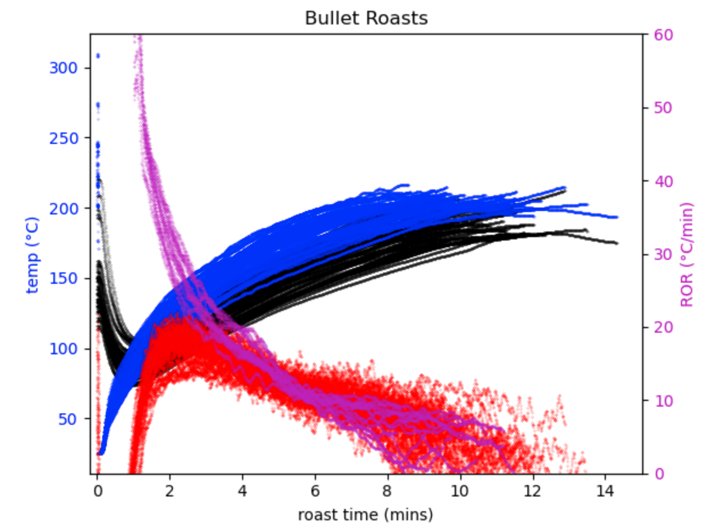

# bullet-roasting
For ingesting, transforming, displaying, and analyzing [Allio Bullet coffee roasting data](https://aillio.com/?page_id=23112).

current state targeted for personal use, interested in expanding functionality with others. Please contact to collaborate

*Note: If your RoastTime isn't installed in the default MacOS location, edit 'base_path' (lines ~18-19)*

*Built for my bullet (hardware version) purchased in July 2020 - noteworthy because the data structure of the .json files have changed over time which requires some merges or gap fixes.*

