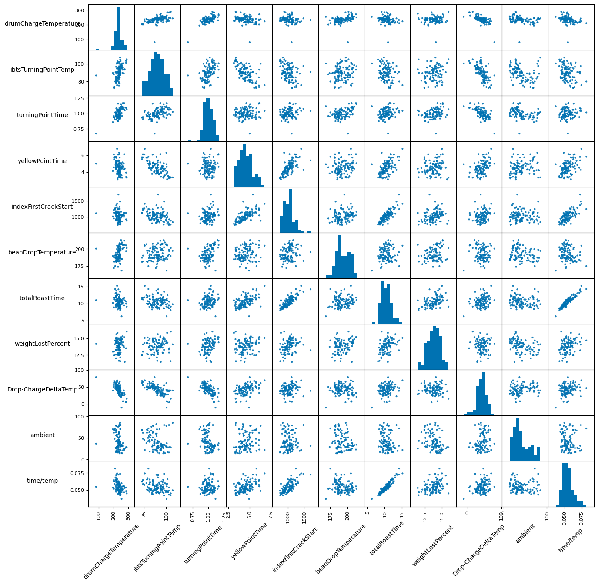

# Allio Bullet Coffee Roasting Data Analysis

This project transforms and analyzes data from the [Allio Bullet coffee roaster](https://aillio.com/?page_id=23112) in order to measure and understand the various factors that influence roast quality. This is a project of my own pasion and interests https://www.instagram.com/f.w.bennies

## Project Structure

 - `main.py`: This is the main script that runs the entire analysis. It calls functions from other modules to perform specific tasks.

 -  `src/data_processing.py`: This module contains functions for processing the raw data. It includes functions to deconstruct temperature curves, create a DataFrame for point attributes for each roast, and calculate the first crack temperature.

 -  `src/origin.py`: This module contains a function to determine the origin of the coffee based on the roast name.

## Key Features

- **Data Transformation**: The raw data is pulled out of hidden and obscured JSON files into a data frame for  analysis. Raw data is exported to a .csv file.

- **Data Cleaning**: The data is cleaned for common errors, outliers, and unwanted records.

- **Temperature Curve Deconstruction**: The temperature curves are deconstructed from lists to a new DataFrame (`curve_df`).

- **Point DataFrame Creation**: A DataFrame (`point_df`) is created to hold point attribute data for each roast.

- **Phase and Feature Engineering**: The `point_df` DataFrame is enhanced with additional points (e.g.turningPointTime, yellowingPhaseTime, and avgYellowingPhaseROR) to characterize and quantify relationships throughout the roast.

- **Origin Determination**: The origin of the coffee is determined based on the roast name using OpenAI GPT3.5 and added to the `point_df` DataFrame.

## Usage

To run the analysis, simply run the `main.py` script. The script will print messages to the console to indicate the progress of the analysis.

## Assumptions
  - Phase and key point temps are IBTS (drum) temps unless specifically noted. Turning point can only be calculated from beanTemp but the same index time is used to find the ibtsTemp at that time. 
 - Several cleanup functions are catered to my own practices, issues, and needs. For example, I rarely roast into second crack and always record ambient temp, humidity and green weight. If you don't record some of these values, the application will likely filter out those rows or totally bugout.
 - Assumed that your RoastTime is installed in the default MacOS location. Else edit 'base_path'
 - Built for my V2 Bullet purchased in July 2020 - the data structure of the .json files have changed over time which requires some merges or gap fixes. I have tended to exclude attributes that have been added or removed from the data file in Allio's updates over the years (roast color, Roast Degree)

## Future Work

Future work on this project will involve more detailed analysis of the data, including statistical analysis and machine learning to predict the quality of the roast based on the available data. Please contact or comment for any questions or collaboration.

